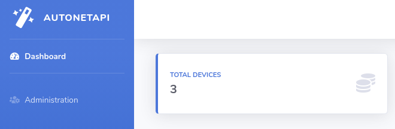

# AutoNetAPI 

Automate the Cisco CSR1000V Router using REST API with Django Framework



### Requirements

Just install it via pip

` pip install -r Requirements.txt `

> Make sure the API services activated through CSR's `virtual-service`

### Installation

1. Clone this repository
2. Make migration of the database
3. Create your Django superadmin
4. Set the administrator roles under groups :
   - superadmin
   - admin

Run
```bash
python manage.py runserver
```
to start the project.
### Features

- Basic Network Configuration
  - Add or Update IP Address
  - Static Route
- Dynamic Route
  - OSPF
  - BGP
- Custom Configuration under the *global configuration mode*
- Validate your configuration through CLI under the *exec mode*
- Export syslog
- List all the registered Devices
- Administration via Django Admin
- Admin and Superadmin Role (editable in User Groups)


Tested running on AWS VPC to manage 3 CSR1000v routers in total.

Any question about network automation, drop your messages [here](https://twitter.com/rafi_citizen06)


